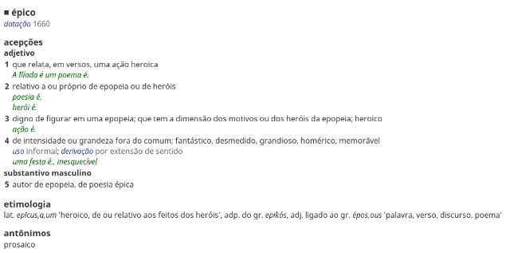

Epos
====

Epos, from the Greek ἔπος (“word”), is a Ruby gem that gives you access to the
data files of the excellent
[Houaiss dictionary](http://www.objetiva.com.br/livro_ficha.php?id=707).

Please notice that you must
[buy the dictionary](http://www.objetiva.com.br/livro_ficha.php?id=707) in order
to use this gem.

Features
--------

* Entries can be retrieved as HTML.
* Both the main dictionary and the morpheme one are supported.
* There's a parser for the structure used by entries.
* There's a parser for the RTF-like format used by the text.
* Characters are rendered correctly, even those in the etymology section or in
  the pronunciation of foreign words.

Example
-------

The following example looks up the word *épico* and saves it to a file:

    require 'epos'
    dict = Epos::Dictionary.new("/home/user/houaiss")
    File.write("épico.html", dict.look_up("épico"))

This is what it should look like:

Limitations
-----------

* No support for animal sounds, verb conjugation, etc.
* No nice interface.

Compatibility
-------------

I know it works with version 2009.6 (July 2013).  I don't know about any other
version.
