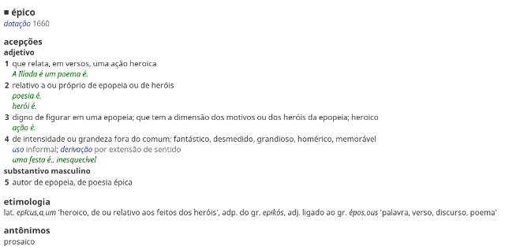

Epos
====

Epos, do grego ἔπος (“palavra”), é uma gem de Ruby que dá acesso aos arquivos de
dados do excelente
[dicionário Houaiss eletrônico da língua portuguesa](http://www.objetiva.com.br/livro_ficha.php?id=707).

Note que você precisa
[comprar o dicionário](http://www.objetiva.com.br/livro_ficha.php?id=707) para
usar esta gem.

Funcionalidades
---------------

* Os verbetes podem ser convertidos para HTML.
* Há um analisador para a estrutura usada nos verbetes.
* Há um analisador para o formato do texto, que é semelhante ao RTF.
* Os caracteres aparecem corretamente, mesmo aqueles na parte de etimologia e na
  pronúncia de palavras estrangeiras.

Instalação
----------

    gem install epos

Exemplo
-------

O seguinet exemplo busca a definição da palavra *épico* e a salva num arquivo:

    require 'epos'
    dict = Epos::Dictionary.new("/home/user/houaiss")
    File.write("épico.html", dict.look_up("épico"))

Deve gerar algo assim:

Limitações
----------

* Não há suporte às vozes de animais, à conjugação verbal, etc.
* Não há uma interface amigável.

Compatibilidade
---------------

Sei que funciona com a versão 2009.6 (Julho de 2013).  Não sei sobre as outras.
